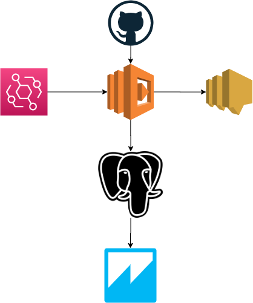

# Event Driven Python
# Overview of Challenge
The challenge topic Event-Driven Python, and its creator is Forrest Brazeal. The challenge is to Automate an ETL processing pipeline for COVID-19 data using Python and cloud services. Forrest has created the perfect template in order for me to build real Python and AWS skills that translate well to helping me solidify by Cloud Practitioner Cert so that I can get a good foundation with AWS tools before I attempt the Solutions Architect Associate Exam. This is all in hopes to build my portfolio strength and help in getting interviews/jobs. 
This project contains source code and supporting files for a serverless application that you can deploy with the SAM CLI. It includes the following files and folders.

- dataDownload - Code for the application's Lambda function.
- tests/unit - Unit tests for the application code. 
- template.yaml - A template that defines the application's AWS resources.

The application uses several AWS resources, including Lambda functions, RDS, EventBridge CloudWatch. These resources are defined in the `template.yaml` file.
<p  align="center">

</p>

Since gaining my Cloud Practitioner Cert in early September I really wanted to delve into a project to solidify my understanding of the AWS cloud products. That is when I found this challenge online by [Forrest Brazeal](https://www.linkedin.com/in/forrestbrazeal/)


# The Challenge Steps
* 1. [ETL-JOB](#ETL-JOB)
* 2. [EXTRACTION](#EXTRACTION)
* 3. [TRANSFORMATION] (#TRANSFORMATION)
* 4. [CODE-CLEANUP] (#CODE-CLEANUP)
* 5. [LOAD](#LOAD)
* 6. [NOTIFICATION](#NOTIFICATION)
* 7. [ERROR-HANDLING] (#ERROR-HANDLING)
* 8. [TESTS](#TESTS)
* 9. [DASHBOARD](#DASHBOARD)
* 10. [BLOG-POST] ()

# Diagram of my Approach
<p  align="center">

</p>

#ETL-JOB
I scheduled the ETL-JOB to be done daily via CloudWatch event management. This was simply by adding under properties for your Lambda Function in `template.yaml` 
```
Events:
        dataDownload:
          Type: Schedule
          Properties:
            Schedule: 'rate(1 day)'
            Description: daily schedule
            Enabled: True
```

#EXTRACTION
Using Pandas before this task was very simple to me. Extracting from an online csv was done easily via pd.read function:
```
nytimes_df = pd.read_csv(nytimes_link)
john_hopkins_df = pd.read_csv(john_hopkins_link)
```

#TRANSFORMATION
Again using pandas in the past the cleaning, joining and filtering were function I had been exposed to in the past.

```
john_hopkins_df = john_hopkins_df[john_hopkins_df["Country/Region"]=='US']  
john_hopkins_df.columns = [x.lower() for x in john_hopkins_df.columns]
        
#Converting to datetime object     
nytimes_df['date'] = pd.to_datetime(nytimes_df['date'], infer_datetime_format=True)     
john_hopkins_df['date'] = pd.to_datetime(john_hopkins_df['date'], infer_datetime_format=True)
       
#changing index to date
nytimes_df = nytimes_df.set_index(['date'])     
john_hopkins_df = john_hopkins_df.set_index(['date'])
       
#dropping all columns on john hopkins except recovered 
john_hopkins_df = john_hopkins_df[['recovered']]
        
#Joining dataframes
df = nytimes_df.join(john_hopkins_df)
```

#CODE-CLEANUP
I took the above code and created a new file out of it called `dataDownload.py`. I created an `init.py` file to make the dataDownload into a function I can call in my main `app.py` file.

#LOAD
I originally used DynamoDB to load my converted data. But further into the steps where I wanted to use QuickSight for dash-boarding I saw a few errors arose due to incompatibility. I quickly switched to RDS-postgreSQL. This is where I trully learned how much of a blessing CloudFormation is. I just literally had to switch few lines and I was done.

```
  PostgreSQL:
    Type: AWS::RDS::DBInstance
    Properties: 
      DBName : CovidDB
      Engine: postgres
      AllocatedStorage: 50
      DBInstanceClass: db.t2.micro
```

For loading the data I used sqlalchemy to create the sql-engine for pandas and psycopg2 to load into postgres.

```
engine = create_engine(F"postgresql://{db_param['user']}:{db_param['password']}@{db_param['hostname']}:{db_param['port']}/{db_param['dbname']}")
```

#NOTIFICATION
This step has also become simple due to CloudFormation. CloudFormation really does make things simple. All I had to do was add a few lines into the template.yaml file under Lambda Function properties:

```
      EventInvokeConfig:
        DestinationConfig:
          OnSuccess:
            Type: SNS
            TopicArn: !Ref CovidDataUpdateSuccess
          OnFailure:
            Type: SNS
            TopicArn: !Ref CovidDataUpdateFailure
      
```

#ERROR-HANDLING
For Error Handling I created a bunch of try/except rules. For except I had each of the steps return an error code. Finally during lambda handler I added 

```
  if error != None:
        return {
        "statusCode": 301,
        "body": json.dumps({
            "message": error,
        }),
    }
```

#TESTS
I created a few unit files to test the error-handling. I checked for errors when creating dataFrame, as well as loading. I also checked to see if the data was being appended instead of recreating the tables all over again. 

#IaC
I converted my infrastructure to Code via CloudFormation yaml file. I listed everything in the `template.yaml` file. 

#SOURCE CONTROL
All of my project files are on my [GitHub-Rad Huda](https://github.com/radhuda/EventDrivenPython)

#DASHBOARD
I hooked up my Database to QuickSight. 
<p  align="center">

</p>

#CHALLENGES
I faced multiple challenges during this project. But 2 of them stuck out due to how long I spent on trying to resolve these issues. 
Problem 1 : DynamoDB and QuickSight integration was an issue.
Solution 1: To solve this I switched over to postgreSQL which was much easier.

Problem 2: I was using SAM CLI via terminal, but I wanted to get it integrated with VSCode. My error was not something I could even google search. For some reason no matter what I did VSCode would not be able to find SAM CLI. So I had to manually do most of the SAM CLI stuff via terminal. Eventually I figured out the issue. Since I was using VSCode via ssh into my desktop SAM CLI would only work from desktop computer itself. It might be a VSCode bug.

#FUN-FACT
I am a pharmacist trying to learn cloud tools to be able to become a solution architect for healthcare. With Operation WarpSpeed changing the face of healthcare today, I can see the tomorrow morphing into a much more cloud dependent world for healthcare. There's so much healthcare can develop once it starts integrating into the cloud.

#CONCLUSION
I am very grateful to Forrest for initiating such an amazing idea. This project was very helpful.

